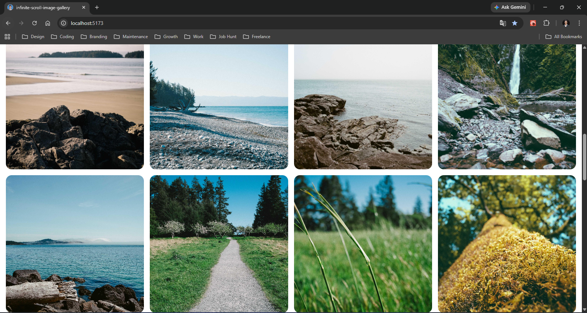

# 🚀 Infinite Scroll Image Gallery

## 📌 Overview

A responsive image gallery that automatically loads more images as the user scrolls, built using modern React patterns and browser APIs.

This project focuses on **performance, clean architecture, and real-world UI behavior**.

---

## ✨ Features

* 🔄 Infinite scroll using **Intersection Observer**
* ⚡ Optimized rendering with **React.memo**
* 🧠 Custom hook: `useInfiniteScroll`
* 🖼️ Lazy-loaded images for better performance
* 📱 Fully responsive grid layout
* 🎯 Stable layout (no shifting issues)

---

## 🧱 Tech Stack

* React (Functional Components)
* Hooks:

  * `useState`
  * `useEffect`
  * `useRef`
  * `useCallback`
* Tailwind CSS
* Intersection Observer API

---

## 🧠 Key Concepts Implemented

### 1. Custom Hook (Separation of Concerns)

All fetching and pagination logic is extracted into:

```js
useInfiniteScroll()
```

This keeps UI and logic clean and reusable.

---

### 2. Infinite Scroll (Intersection Observer)

Instead of scroll events, the app observes the last image:

* When it enters the viewport → load next page
* Improves performance and avoids unnecessary listeners

---

### 3. Performance Optimization

* `React.memo` prevents unnecessary re-renders
* `forwardRef` allows passing refs to optimized components

---

### 4. Responsive Layout

* Grid-based layout using Tailwind
* Images use `aspect-square` and `object-cover` for consistency

---

## ⚙️ How It Works

1. Images are fetched from the Picsum API
2. Data is stored in state via custom hook
3. Last image is observed using Intersection Observer
4. When visible → next page is fetched
5. New images are appended to the gallery

---

## 🧪 Run Locally

```bash
git clone https://github.com/mukteswar-git/react/tree/main/PHASE%202%20-%20Advanced%20Hooks%20and%20Patterns/infinite-scroll-image-gallery
cd react/PHASE\ 2\ -\ Advanced\ Hooks\ and\ Patterns/infinite-scroll-image-gallery
npm install
npm run dev
```

---

## 📚 What I Learned

* How to build reusable logic using custom hooks
* How Intersection Observer works in real applications
* Performance optimization using memoization
* Managing side effects and dependencies correctly
* Building responsive layouts with Tailwind CSS

---

## 🚀 Future Improvements

* Add search with debouncing
* Skeleton loading UI
* Image preview modal
* Virtualized list for large datasets

---

## 📸 Preview



---
## 🚀 Live Demo

👉 [View Live App](https://infinite-scroll-image-gallery-brown.vercel.app/)

## 🧑‍💻 Author

Mukteswar
